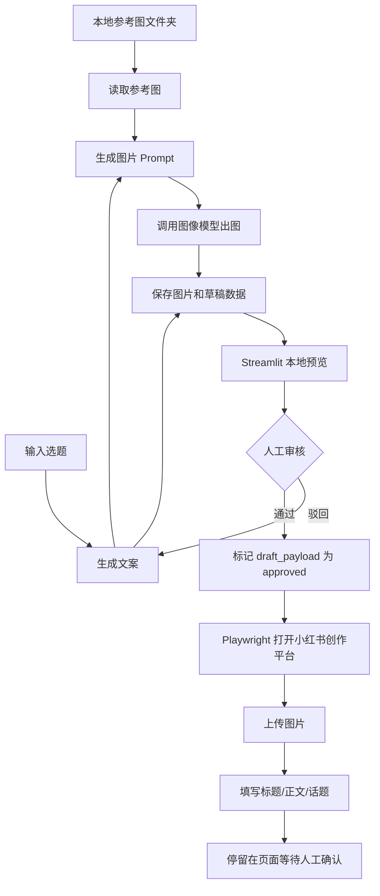

# 小红书图文草稿生成工具完整方案

## 1. 项目目标

基于本地参考图和用户输入选题，自动生成小红书图文笔记的文案、配图和草稿数据，并在人工审核通过后，通过 Playwright 打开小红书创作服务平台，自动上传图片、填写标题、正文和话题，最后停留在创作页面，由人工做最终确认。

第一版只做“自动创建草稿”，不做自动发布。

## 2. 核心原则

- 本地优先：参考图、生成结果、草稿数据都保存在本地文件夹。
- 人工审核：生成内容必须经过本地页面审核后，才允许创建小红书草稿。
- 不绕过平台限制：登录、扫码、验证码、风控、最终发布全部由人工处理。
- 可维护：小红书页面结构可能变化，浏览器自动化脚本需要允许人工接管，并把选择器集中维护。
- 轻量闭环：第一版不引入数据库、任务队列、复杂 Agent 编排和多账号系统。

## 3. 第一版完整流程

```text
本地参考图文件夹
-> 输入选题
-> 读取参考图
-> 生成文案结构
-> 生成图片 Prompt
-> 调用图像模型生成图片
-> 保存输出文件和 draft_payload.json
-> Streamlit 本地预览
-> 人工审核
-> 审核通过后调用 Playwright
-> 打开小红书创作平台
-> 上传图片
-> 填写标题、正文、话题
-> 停留在页面等待人工确认
```



## 4. 功能边界

| 功能 | 第一版是否做 | 说明 |
|---|---:|---|
| 从本地文件夹读取参考图 | 是 | 支持按 cover/content/ending 分类 |
| 输入选题生成文案 | 是 | 生成标题、正文、话题、图片页文案 |
| 根据参考图生成图片 | 是 | 使用支持参考图的图像模型 |
| 本地预览 | 是 | 用 Streamlit 展示文案和图片 |
| 人工审核 | 是 | 通过、驳回、重新生成 |
| 自动创建小红书草稿 | 是 | 用 Playwright 填写创作页 |
| 自动发布 | 否 | 必须人工确认发布 |
| 多账号管理 | 否 | 第一版只保存一个浏览器 Profile |
| 数据看板 | 否 | 后续再做 |
| 自动处理验证码/风控 | 否 | 遇到后暂停人工处理 |
| 复杂 Agent 编排 | 否 | 第一版用普通服务函数即可 |

## 5. 推荐项目结构

```text
xhs-style-agent/
  app.py
  config.py
  requirements.txt
  .env

  services/
    copy_service.py
    image_service.py
    ref_service.py
    review_service.py
    export_service.py
    xhs_draft_service.py

  automation/
    xhs_creator_bot.py
    selectors.py

  prompts/
    copywriting_prompt.txt
    image_prompt_prompt.txt
    style_analysis_prompt.txt
    safety_check_prompt.txt

  assets/
    refs/
      my_style/
        cover/
        content/
        ending/

    outputs/

  browser_profile/
    xhs/
```

## 6. 本地参考图目录

推荐把参考图按图片用途分成三类：

```text
assets/refs/my_style/
  cover/
    cover_01.png
    cover_02.png
  content/
    content_01.png
    content_02.png
  ending/
    ending_01.png
```

生成时按页面类型使用参考图：

| 页面类型 | 使用参考图 |
|---|---|
| cover | `assets/refs/my_style/cover/` |
| content | `assets/refs/my_style/content/` |
| ending | `assets/refs/my_style/ending/` |

如果没有分类文件夹，则退化为读取 `assets/refs/my_style/` 下的全部图片。

## 7. 输出目录结构

每次生成内容时，创建一个独立输出目录：

```text
assets/outputs/
  20260514_173000_ai_tools/
    cover.png
    image_1.png
    image_2.png
    image_3.png
    title.txt
    body.txt
    hashtags.txt
    publish.md
    draft_payload.json
    generation_meta.json
```

## 8. draft_payload.json 设计

`draft_payload.json` 是审核和创建小红书草稿之间的核心数据包。

```json
{
  "status": "pending_review",
  "topic": "AI工具效率提升",
  "title": "这5个AI工具，真的帮我少做了很多重复活",
  "body": "最近我把工作里最重复的几个环节重新整理了一下...",
  "hashtags": ["AI工具", "效率工具", "职场干货", "打工人"],
  "images": [
    "assets/outputs/20260514_173000_ai_tools/cover.png",
    "assets/outputs/20260514_173000_ai_tools/image_1.png",
    "assets/outputs/20260514_173000_ai_tools/image_2.png"
  ],
  "pages": [
    {
      "page": 1,
      "type": "cover",
      "main_text": "5个AI工具",
      "sub_text": "少做重复活",
      "visual_instruction": "强标题封面，适合点击"
    }
  ],
  "created_at": "2026-05-14T17:18:39+08:00",
  "updated_at": "2026-05-14T17:18:39+08:00"
}
```

状态建议：

| status | 含义 |
|---|---|
| `pending_review` | 已生成，等待人工审核 |
| `approved` | 审核通过，可以创建草稿 |
| `rejected` | 审核驳回 |
| `draft_created` | 已自动填入小红书创作页 |
| `failed` | 创建草稿失败 |

## 9. 核心模块职责

### 9.1 ref_service.py

负责读取本地参考图。

核心函数：

```python
list_reference_images(ref_dir: str) -> list[str]
list_reference_images_by_type(ref_dir: str) -> dict[str, list[str]]
```

### 9.2 copy_service.py

负责生成小红书文案和图片页结构。

核心函数：

```python
generate_note_copy(topic: str, style_profile: dict | None = None) -> dict
```

输出包含：

- 标题
- 正文
- 话题标签
- 图片页结构
- 每页主标题、副标题、视觉说明

### 9.3 image_service.py

负责调用图片模型生成图片。

核心函数：

```python
generate_images_for_note(
    pages: list[dict],
    style_profile: dict,
    ref_dir: str,
    output_dir: str
) -> list[str]
```

### 9.4 export_service.py

负责保存生成结果。

核心函数：

```python
save_draft_payload(...)
mark_payload_approved(output_dir: str) -> dict
update_payload_status(output_dir: str, status: str) -> dict
```

### 9.5 review_service.py

负责审核状态和重生成动作。

第一版可以只封装简单状态逻辑，不需要数据库。

### 9.6 xhs_draft_service.py

负责从输出目录读取 `draft_payload.json`，并调用浏览器自动化脚本。

核心函数：

```python
create_draft_from_output(output_dir: str) -> None
```

### 9.7 automation/xhs_creator_bot.py

负责打开小红书创作平台，上传图片，填写标题和正文。

核心函数：

```python
create_xhs_draft(
    title: str,
    body: str,
    hashtags: list[str],
    image_paths: list[str],
    user_data_dir: str = "browser_profile/xhs",
    headless: bool = False
) -> None
```

注意事项：

- 不点击发布按钮。
- 第一次运行需要人工扫码登录。
- 遇到验证码、风控、登录失效时暂停。
- 页面选择器集中放到 `automation/selectors.py`，方便维护。

## 10. Streamlit 页面设计

第一版页面不需要复杂导航，可以分为四块：

### 10.1 配置区

- 参考图目录
- 输出目录
- 文本模型
- 图片模型

### 10.2 生成区

- 选题输入框
- 生成内容按钮
- 重新生成文案按钮
- 重新生成图片按钮

### 10.3 预览区

- 标题预览
- 正文预览
- 话题预览
- 图片预览
- 每页图片文案预览

### 10.4 审核区

- 驳回
- 通过
- 通过并生成小红书草稿

## 11. Playwright 自动化流程

```text
读取 draft_payload.json
-> 校验图片路径是否存在
-> 启动持久化 Chromium Context
-> 打开小红书创作平台
-> 如果未登录，等待人工扫码
-> 定位图片上传 input
-> 上传图片
-> 填写标题
-> 填写正文和话题
-> 停留在页面等待人工确认
```

小红书创作平台地址：

```text
https://creator.xiaohongshu.com/publish/publish?source=official
```

浏览器 Profile：

```text
browser_profile/xhs/
```

## 12. 环境变量

`.env` 推荐配置：

```bash
REF_IMAGE_DIR=assets/refs/my_style
OUTPUT_DIR=assets/outputs

TEXT_MODEL_PROVIDER=ark
TEXT_MODEL_NAME=Doubao-Seed-2.0-lite
# 如果火山方舟控制台要求 endpoint/model ID，可用 TEXT_MODEL_ID 覆盖展示名
# TEXT_MODEL_ID=doubao-seed-2-0-lite-260215

IMAGE_MODEL_PROVIDER=ark
IMAGE_MODEL_NAME=Doubao-Seedream-5.0-lite
IMAGE_MODEL_ID=doubao-seedream-5-0-260128

ALIYUN_API_KEY=你的阿里云百炼Key
ARK_API_KEY=你的火山方舟Key

XHS_BROWSER_PROFILE=browser_profile/xhs
XHS_HEADLESS=false
```

## 13. Python 依赖

`requirements.txt`：

```txt
streamlit
python-dotenv
pydantic
pillow
requests
python-slugify
playwright
```

第一次使用 Playwright 时安装浏览器：

```bash
playwright install chromium
```

启动本地工具：

```bash
streamlit run app.py
```

## 14. 实现优先级

### P0：最小可用闭环

- 读取本地参考图
- 输入选题
- 生成文案
- 生成图片
- 保存 `draft_payload.json`
- 本地预览
- 人工审核按钮

### P1：小红书草稿自动填充

- Playwright 打开小红书创作平台
- 保存登录态
- 上传图片
- 填写标题
- 填写正文和话题
- 停留等待人工确认

### P2：体验增强

- 单张图片重生成
- 多个参考图风格文件夹
- 历史记录列表
- 导出 Markdown 发布稿
- 失败重试和错误日志

## 15. 风险和处理方式

| 风险 | 处理方式 |
|---|---|
| 小红书页面结构变化 | 选择器集中维护，失败时提示人工接管 |
| 登录态过期 | 使用持久化 Profile，过期后人工扫码 |
| 验证码或风控 | 脚本暂停，人工处理 |
| 图片模型生成文字不清晰 | 图片页文字尽量短，必要时改为本地排版渲染文字 |
| 参考图风格不稳定 | 增加风格分析步骤，固化 style_profile |
| 文案格式不稳定 | 要求文本模型输出严格 JSON，并做 Pydantic 校验 |

## 16. 第一版验收标准

- 可以读取 `assets/refs/my_style/` 下的参考图。
- 可以输入一个选题并生成标题、正文、话题、图片页文案。
- 可以生成至少 3 张图文图片。
- 可以保存完整的 `draft_payload.json`。
- 可以在本地页面预览内容。
- 可以人工审核通过。
- 审核通过后可以打开小红书创作平台。
- 可以自动上传图片并填写标题、正文、话题。
- 不自动点击发布。

